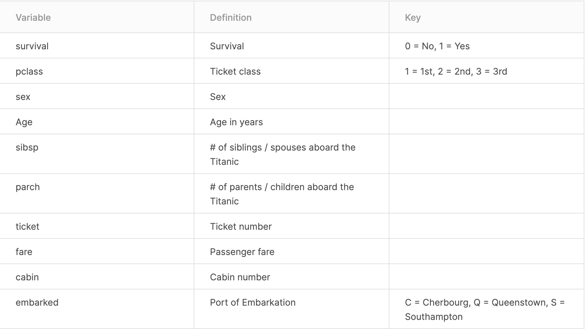

# Titanic Hypothesis Testing

## Objective

For this analysis we are going to go through a titanic csv dataset and conduct an analytical investigation on what factors contributed to the survival of those who survived the titanic.

For this analysis I will be focused on investigating the following questions about surviving the titanic.

## Exploratory Questions
For this analysis I will be focused on investigating the following questions about surviving the titanic.

* Is there a gender gap between people who survived and people who died?
* What is the age gap between people who survived and people who lived?
What is the relationship between age and sex of survivor?
* Is there a relationship between embarkment location and pclass to survival?
* Finally, there is a conclusion about the data analysis and a recommendation for more in-depth analysis.

## Method

#####  Two-Tailed Independent Z-Test
We are going to perform a two-tailed independent proportion Z-test to compare both male and female survival proportions within each age interval at an $\alpha$ level of .05.

I am performing a Z-Test because I am comparing proportions of survival for the independent variable. The independent variables has two categories that are unrelatable and both the independent and dependent variable are categorical. For each dependent variable outcome we have at least 5 survival and 5 death outcomes, except for bin age 60-69.

## Conclusion
From the analytical investigation, it is clear that gender played a vital role in surviving the titanic because women were proportionally more likely to survive than men. Age also had a relationship to survival, because it is notable that children had the highest proportion of survival to any other age group. More so, what is notable is that in every age interval of 10, the difference between proportions of survival between men and women were significantly different from, except for children. Thus children of ages 0-9 that were either male or female survived at similar, if not equal, proportions opposed to the other age intervals.

Now, Pclass and Embarkment seemed to play a vital role as well, although this is simply based on observation. People that embarked on Southampton had a higher proportion of survival, and although it comes as no surprise, those of Pclass 1 also had a higher proportion of survival. Those that embarked on location Queenstown or were part of Pclass 3 had the highest mortality proportions. Does, those that survived the titanic at higher proportions were notably either children, women, embarked on location S or were of the upper socio-economic status. Personally, this seems to be indicative of the movie Titanic and therefore I trust my findings.

## Data Dictionary

